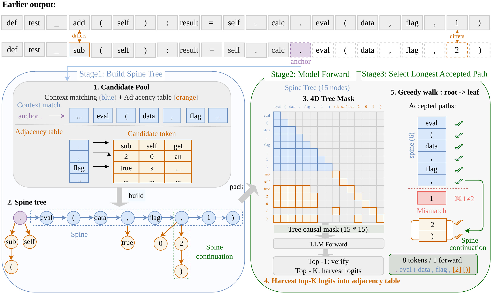

# Goose: Anisotropic Speculation Trees for Training-Free Speculative Decoding

Official implementation of the COLM 2026 paper *Goose: Anisotropic Speculation Trees for
Training-Free Speculative Decoding* by Tao Jin, Phuong Minh Nguyen and Naoya Inoue.

Goose is a training-free speculative decoding method. Context matching (as in prompt lookup
decoding) drafts a deep spine, and an adjacency table built from the model's own logits
(as in Token Recycling) adds branches along it. The target model verifies the whole tree
in one forward pass.



## Installation

```bash
pip install -e .                 # decoder
pip install -e ".[benchmarks]"   # decoder and dataset loaders
```

## Usage

```python
import torch
from transformers import AutoModelForCausalLM, AutoTokenizer
from goose import decode

name = "meta-llama/Meta-Llama-3-8B-Instruct"
tokenizer = AutoTokenizer.from_pretrained(name)
model = AutoModelForCausalLM.from_pretrained(
    name, torch_dtype=torch.float16, device_map="auto",
    attn_implementation="sdpa",  # or "eager"; tree verification needs a custom attention mask
).eval()

input_ids = tokenizer("def quicksort(arr):", return_tensors="pt").input_ids.to(model.device)
output, stats = decode(model, tokenizer, input_ids, max_new_tokens=512)

print(tokenizer.decode(output[0]))
print(f"{stats.compression_ratio:.2f} tokens per forward pass")
```

Hyperparameters are set with `goose.GooseConfig`, whose defaults follow the paper.

## Benchmarks

```bash
# one model on one benchmark, against autoregressive decoding
python benchmarks/run_benchmark.py --model llama3-8b --dataset humaneval \
    --methods ar goose --stop-tokens tokenizer
python benchmarks/summarize.py results

# the paper's main grid: five models, five benchmarks
bash benchmarks/run_paper_experiments.sh
```

`--stop-tokens tokenizer` applies the paper's stopping rule. Qwen3-8B is loaded in BF16 by
default; add `--dtype float16` to match the paper. Results may differ slightly from those
reported in the paper.

## Tests

```bash
python -m pytest tests   # set GOOSE_TEST_MODEL=<model> to include end-to-end checks
```

## Citation

```bibtex
@inproceedings{jin2026goose,
  title     = {Goose: Anisotropic Speculation Trees for Training-Free Speculative Decoding},
  author    = {Jin, Tao and Nguyen, Phuong Minh and Inoue, Naoya},
  booktitle = {Conference on Language Modeling (COLM)},
  year      = {2026}
}
```

## License

MIT. Contact: Tao Jin (morgan@jaist.ac.jp).
